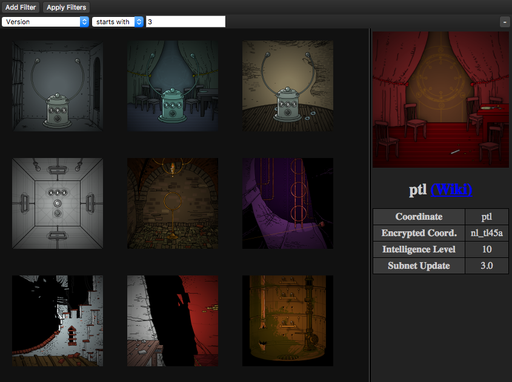

# Subnet Browse

A simple experiment that lets you explore the locations of the
[Submachine Universe][subnet] (aka Subnet).

It's designed for discovering and exploring patterns - you can make good use of
the filter button!

Try it out online [here](online).

## Credits

All screenshots of locations were taken from the [Submachine Wiki][wiki]

The actual Submachine Universe, as well as the pictures, were created by
[Mateusz Skutnik][mateusz]

  [online]: https://liam4.github.io/subnet-thing/
  [subnet]: http://submachine.wikia.com/wiki/Submachine_Universe
  [wiki]: http://submachine.wikia.com
  [mateusz]: http://mateuszskutnik.com
